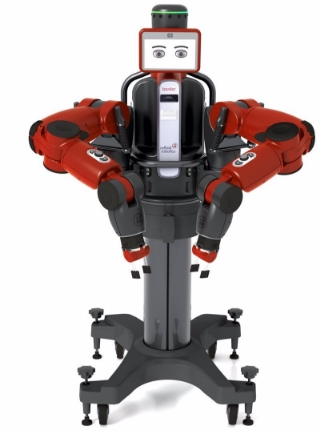
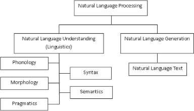
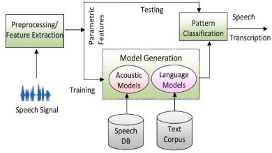
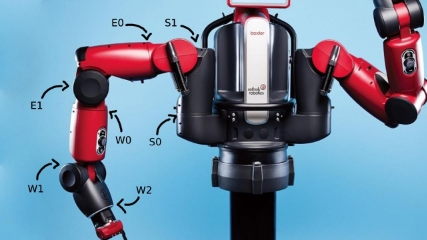

# Baxter-NLPActions

UNIVERSIDAD DE CONCEPCIÓN FACULTAD DE INGENIERÍA

INTERACCIÓN Y MOVIMIENTO DEL ROBOT BAXTER MEDIANTE LENGUAJE NATURAL

Por: Camilo Ruiz Bucarey

Tesis presentada a la Facultad de Ingeniería de la Universidad de Concepción para optar al título profesional de Ingeniero Civil Informático

— 2023

Concepción, Chile

Profesor Guía: Julio Godoy del Campo

© 2023, Camilo Ruiz B.

Se autoriza la reproducción total o parcial, con fines académicos, por cualquier medio o procedimiento, incluyendo la cita bibliográfica del documento

Al futuro rey de los piratas, Monkey D. Luffy

ii![ref1]

AGRADECIMIENTOS

Quisque ullamcorper placerat ipsum. Cras nibh. Morbi vel justo vitae lacus tincidunt ultrices. Lorem ipsum dolor sit amet, consectetuer adipiscing elit. In hac habitasse platea dictumst. Integer tempus convallis augue. Etiam facilisis. Nunc elementum fermentum wisi. Aenean placerat. Ut imperdiet, enim sed gravida sollicitudin, felis odio placerat quam, ac pulvinar elit purus eget enim. Nunc vitae tortor. Proin tempus nibh sit amet nisl. Vivamus quis tortor vitae risus porta vehicula.

Fusce mauris. Vestibulum luctus nibh at lectus. Sed bibendum, nulla a faucibus semper, leo velit ultricies tellus, ac venenatis arcu wisi vel nisl. Vestibulum diam. Aliquam pellentesque, augue quis sagittis posuere, turpis lacus congue quam, in hendrerit risus eros eget felis. Maecenas eget erat in sapien mattis porttitor. Vestibulum porttitor. Nulla facilisi. Sed a turpis eu lacus commodo facilisis. Morbi fringilla, wisi in dignissim interdum, justo lectus sagittis dui, et vehicula libero dui cursus dui. Mauris tempor ligula sed lacus. Duis cursus enim ut augue. Cras ac magna. Cras nulla. Nulla egestas. Curabitur a leo. Quisque egestas wisi eget nunc. Nam feugiat lacus vel est. Curabitur consectetuer.

Resumen

Este documento describe un proyecto de Memoria de Título de Ingeniería Civil Informática, el cual consistió en lograr que Baxter, un robot humanoide, realice diversas acciones definidas previamente según una orden de texto escrito o voz hablada en lenguaje natural. Se describe la implementación de un sistema que realiza dicha labor, interpreta el lenguaje natural, procesa la entrada recibida

y detecta la acción indicada para finalmente ejecutarla por medio de Baxter. Se define cada una de las acciones posibles de realizar por Baxter, así como su jerarquía para la construcción de acciones más complejas. El sistema implementado es capaz de interpretar correctamente el lenguaje natural para realizar la acción deseada por el usuario, considerando oraciones claras respecto a la acción deseada. Se describen situaciones problemáticas que se presentaron durante el desarrollo y las acciones tomadas para completar el objetivo.

Keywords – Baxter, Lenguaje Natural (LN), Procesamiento de Lenguaje Natural (NLP)

Índice general iii![ref2]

Índice general

[AGRADECIMIENTOS](#_page0_x72.00_y90.78) i [Resumen](#_page0_x72.00_y90.78) ii

1. [Introducción](#_page8_x113.39_y113.39) 1
2. [Marco Teórico](#_page11_x70.87_y113.39) 4
1. [Procesamiento de lenguaje natural ](#_page11_x70.87_y327.09). . . . . . . . . . . . . . . . . 4
1. [Reconocimiento automático del habla . ](#_page13_x70.87_y113.39). . . . . . . . . . . 6
1. [Procesamiento de texto?? ](#_page14_x113.39_y231.07). . . . . . . . . . . . . . . . . . 7
2. [Robots ](#_page15_x70.87_y371.03). . . . . . . . . . . . . . . . . . . . . . . . . . . . . . . . . 8

[2.2.1. Baxter ](#_page16_x113.39_y508.43). . . . . . . . . . . . . . . . . . . . . . . . . . . . . 9

3. [Metodología](#_page17_x70.87_y113.39) 10
4. [Análisis](#_page18_x113.39_y113.39) 11
4. [Discusión](#_page19_x70.87_y113.39) 12
4. [Conclusión](#_page20_x113.39_y113.39) 13 [Referencias](#_page20_x113.39_y113.39) 14 [Apéndices](#_page21_x70.87_y113.39) 15

[A. Test](#_page22_x113.39_y113.39) 15 A1. Código fuente . . . . . . . . . . . . . . . . . . . . . . . . . . . . . 15 A2. Acciones definidas . . . . . . . . . . . . . . . . . . . . . . . . . . . 15

iv Índice de cuadros

Índice de cuadros

Índice de figuras v![ref2]

Índice de figuras

1\.0.1.Robot Baxter . . . . . . . . . . . . . . . . . . . . . . . . . . . . . 2

[2.1.1.Broad classification of NLP ](#_page12_x113.39_y263.52). . . . . . . . . . . . . . . . . . . . . 5 [2.1.2.Schematic architecture of a speech recognizer ](#_page13_x70.87_y470.63). . . . . . . . . . . . 6

A1.1.Articulaciones del brazo del robot Baxter . . . . . . . . . . . . . . 15 A2.1.UdeC logo . . . . . . . . . . . . . . . . . . . . . . . . . . . . . . . 16

Capítulo 1. Introducción 1![ref3]

Capítulo 1 Introducción

En la actualidad, los robots se han vuelto cada vez más comunes en la sociedad. Su uso se extiende desde la industria hasta el hogar, y su versatilidad los hace ideales para una gran cantidad de aplicaciones. Sin embargo, el uso de los robots sigue siendo limitado por la necesidad de programar sus acciones mediante lenguajes de programación específicos. Esto supone una barrera de entrada para muchas personas que no tienen habilidades de programación y limita la utilización de los robots por parte de la sociedad en general.

La programación de robots mediante lenguajes de programación específicos es una tarea compleja que requiere habilidades técnicas especializadas. Este proceso puede ser costoso y lleva mucho tiempo, y en muchos casos, los robots pueden requerir una programación específica para cada tarea que deben realizar.

En este contexto, la interacción mediante lenguaje natural con los robots surge como una posible solución a esta barrera de entrada. En lugar de programar los robots mediante lenguajes de programación específicos, los usuarios podrían interactuar con ellos utilizando lenguaje natural, lo que permitiría a una mayor cantidad de personas utilizar los robots.

La interacción mediante lenguaje natural se refiere a la capacidad de los robots para interpretar y responder a los comandos en lenguaje natural, como mueve el brazo a la izquierda o abre la puerta . Esto permitiría a los usuarios interactuar con los robots de una manera más intuitiva y natural, lo que podría mejorar la usabilidad y la accesibilidad de los robots.

2![ref1]

Baxter es un robot humanoide, desarrollado y distribuido por la compañía Rethink Robotics (Fitzgerald, 2013). Posee 2 brazos con 7 articulaciones en cada uno para asemejar el movimiento del brazo humano (ver Figura A1.1), 3 de estas simulan el movimiento de hombro, codo y muñeca, respectivamente, además de 4 articulaciones rotatorias. Cada articulación de los brazos posee su propio rango de movimiento en sentido horario y antihorario. Un par de pinzas o “grippers” ubicados como manos en cada brazo, las cuales permiten la manipulación de pequeños objetos. Una pantalla o “cara” con una cámara frontal y 2 articulaciones encargadas del movimiento vertical y horizontal de la “cabeza”. En dicha “cara” es posible mostrar información relevante o imágenes que apoyen el proyecto.

Si bien Baxter se encuentra actualmente descontinuado desde el año 2018, aún es interesante su uso académico para la realización de diversas tareas y proyectos tal como puede ser el armado de cubos Rubik automático (Bolivar et al., 2019) o su uso para resolver el problema de robotic grasping (Montaño and Godoy, 2019).

Figura 1.0.1: Robot Baxter

3![ref3]

El objetivo general de este trabajo es proponer un sistema que, mediante un modelo de procesamiento de lenguaje natural, permita comunicarse con el robot Baxter para que realice las acciones indicadas por voz hablada o texto escrito.

Como objetivos específicos se tiene:

1. Definir e implementar tareas realizables por el robot Baxter mediante el uso de ROS.
1. Implementar un modelo de procesamiento de lenguaje natural que se comunique con Baxter.

Para el desarrollo de este proyecto, se utilizó el robot Baxter presente en la Universidad de Concepción, ubicado en el Laboratorio FabLab del edificio Tecnológico Mecánico de la Facultad de Ingeniería.

4 Capítulo 2. Marco Teórico![ref1]

Capítulo 2 Marco Teórico

1. Procesamiento de lenguaje natural

El procesamiento de lenguaje natural (PLN) es una rama de la inteligencia artificial la cual se encarga de que maquinas o sistemas sean capaces de manipular el lenguaje humano, ya sea de forma escrita o hablada, todo esto con el objetivo de desarrollar herramientas que permitan la realización de variadas tareas que permitan, por ejemplo, facilitar la interacción humano-máquina o comprender de mejor manera la intención con respecto a un texto o la generación de textos en base a ciertos parámetros (DeepLearning.AI, 2023).

Los inicios del PLN se dan a mediados del siglo XX como una intersección entre la inteligencia artificial y la lingüística, originalmente haciendo una separación con lo que eran las técnicas de indexación y búsqueda para extracción de información de un texto, para con el tiempo ir convergiendo entre sí (Nadkarni et al., 2011). En la actualidad, el PLN se encuentra en el día a día de muchas personas a lo largo del mundo a través de diversas herramientas y aplicaciones, algunas de estas son los asistentes virtuales como Siri o Alexa de Apple y Amazon respectivamente, y las herramientas de transcripción de texto automática que se pueden encontrar en Microsoft Teams o Skype.

Es posible dividir a nivel general el PLN en dos porciones principales; la comprensión del lenguaje natural y la generación de lenguaje natural (Khurana et al., 2022). Por el lado de la comprensión, se tiene todo lo relacionado con el entendimiento y análisis lingüístico en función del significado y contexto de los

1. Procesamiento de lenguaje natural 5![ref3]

conceptos, emociones y palabras clave que se reflejan en el lenguaje, esto implica estudios a diversos niveles tal como fonética, morfología y sintaxis del lenguaje, entre otros. Por otro lado, se encuentra la generación de lenguaje natural, la cual como su nombre indica, se centra en el proceso de producir oraciones y/o párrafos que tengan un sentido lógico e incluso que se logre simular una conversación entre personas. En la Figura 2.1.1 es posible apreciar la división y desglose de dichas categorías.

Figura 2.1.1: Broad classification of NLP Fuente: ([Khurana et al., 2022)](#_page21_x41.60_y367.68)

En este sentido, la comprensión del lenguaje permite que una máquina reconozca las características fonéticas y sintácticas de una grabación de audio para identificar palabras de un idioma determinado y así realizar una transcripción de voz hablada a texto. Esto se conoce como reconocimiento automático del habla (RAH) y es la base para el desarrollo de una gran variedad de herramientas relacionadas con el PLN.

6 2.1. Procesamiento de lenguaje natural![ref1]

1. Reconocimiento automático del habla

IBM (IBM, 2023) define al reconocimiento del habla, también denominado conversión de voz a texto, como una función que utiliza el PLN para procesar el habla humana y transformarlo a formato escrito, así mismo hace la diferencia de este con respecto al reconocimiento de voz, ya que este se enfoca en un único usuario individual para la identificación de la voz mientras que el RAH posee un enfoque más amplio, independiente del individuo presentado. De esta manera, podemos definir el RAH como la capacidad de que una máquina o programa computacional identifique palabras u oraciones en formato de lenguaje hablado para así convertirlas en un formato comprensible por dicha máquina y posteriormente transcribir el mensaje a un formato de texto en un idioma determinado.

En la figura 2.1.2 se puede apreciar el modelado básico para la generación de un sistema de reconocimiento de voz, considerando su fase de entrenamiento y su prueba funcional. Es importante notar que, si bien en el proyecto actual no se realizó un entrenamiento de un modelo particular de reconocimiento de voz, entender sus bases es relevante para comprender de mejor manera el funcionamiento del mismo.

Figura 2.1.2: Schematic architecture of a speech recognizer Fuente: ([Saksamudre et al., 2015)](#_page21_x41.60_y504.92)

Durante la etapa de pattern matching es posible encontrar una gran variedad de técnicas para el reconocimiento y clasificación de patrones, los cuales pueden ser desde técnicas basadas en comparación de plantillas de referencia que representen diccionarios de palabras, hasta técnicas basadas en algoritmos como Dynamic

1. Procesamiento de lenguaje natural 7![ref3]

Time Warping el cual pondera la similitud ente diferentes secuencias basado en su variación de tiempo y velocidad.([Saksamudre et al., 2015](#_page21_x41.60_y504.92)) En particular, se trabajó sobre la API de reconocimiento de voz provista por Google Cloud la cual está construida sobre un modelo de Deep learning de redes neuronales recurrentes pudiendo soportar procesos de reconocimiento complejos con un alto nivel de precisión.

2. Procesamiento de texto??

Suspendisse vitae elit. Aliquam arcu neque, ornare in, ullamcorper quis, commodo eu, libero. Fusce sagittis erat at erat tristique mollis. Maecenas sapien libero, molestie et, lobortis in, sodales eget, dui. Morbi ultrices rutrum lorem. Nam elementum ullamcorper leo. Morbi dui. Aliquam sagittis. Nunc placerat. Pellentesque tristique sodales est. Maecenas imperdiet lacinia velit. Cras non urna. Morbi eros pede, suscipit ac, varius vel, egestas non, eros. Praesent malesuada, diam id pretium elementum, eros sem dictum tortor, vel consectetuer odio sem sed wisi.

Sed feugiat. Cum sociis natoque penatibus et magnis dis parturient montes, nascetur ridiculus mus. Ut pellentesque augue sed urna. Vestibulum diam eros, fringilla et, consectetuer eu, nonummy id, sapien. Nullam at lectus. In sagittis ultrices mauris. Curabitur malesuada erat sit amet massa. Fusce blandit. Aliquam erat volutpat. Aliquam euismod. Aenean vel lectus. Nunc imperdiet justo nec dolor.

Etiam euismod. Fusce facilisis lacinia dui. Suspendisse potenti. In mi erat, cursus id, nonummy sed, ullamcorper eget, sapien. Praesent pretium, magna in eleifend egestas, pede pede pretium lorem, quis consectetuer tortor sapien facilisis magna. Mauris quis magna varius nulla scelerisque imperdiet. Aliquam non quam. Aliquam porttitor quam a lacus. Praesent vel arcu ut tortor cursus volutpat. In vitae pede quis diam bibendum placerat. Fusce elementum convallis neque. Sed dolor orci, scelerisque ac, dapibus nec, ultricies ut, mi. Duis nec dui quis leo sagittis commodo.

Aliquam lectus. Vivamus leo. Quisque ornare tellus ullamcorper nulla. Mauris porttitor pharetra tortor. Sed fringilla justo sed mauris. Mauris tellus. Sed non leo. Nullam elementum, magna in cursus sodales, augue est scelerisque sapien, venenatis congue nulla arcu et pede. Ut suscipit enim vel sapien. Donec congue.

8 2.2. Robots![ref1]

Maecenas urna mi, suscipit in, placerat ut, vestibulum ut, massa. Fusce ultrices nulla et nisl.

Etiam ac leo a risus tristique nonummy. Donec dignissim tincidunt nulla. Vestibulum rhoncus molestie odio. Sed lobortis, justo et pretium lobortis, mauris turpis condimentum augue, nec ultricies nibh arcu pretium enim. Nunc purus neque, placerat id, imperdiet sed, pellentesque nec, nisl. Vestibulum imperdiet neque non sem accumsan laoreet. In hac habitasse platea dictumst. Etiam condimentum facilisis libero. Suspendisse in elit quis nisl aliquam dapibus. Pellentesque auctor sapien. Sed egestas sapien nec lectus. Pellentesque vel dui vel neque bibendum viverra. Aliquam porttitor nisl nec pede. Proin mattis libero vel turpis. Donec rutrum mauris et libero. Proin euismod porta felis. Nam lobortis, metus quis elementum commodo, nunc lectus elementum mauris, eget vulputate ligula tellus eu neque. Vivamus eu dolor.

2. Robots

Suspendisse vitae elit. Aliquam arcu neque, ornare in, ullamcorper quis, commodo eu, libero. Fusce sagittis erat at erat tristique mollis. Maecenas sapien libero, molestie et, lobortis in, sodales eget, dui. Morbi ultrices rutrum lorem. Nam elementum ullamcorper leo. Morbi dui. Aliquam sagittis. Nunc placerat. Pellentesque tristique sodales est. Maecenas imperdiet lacinia velit. Cras non urna. Morbi eros pede, suscipit ac, varius vel, egestas non, eros. Praesent malesuada, diam id pretium elementum, eros sem dictum tortor, vel consectetuer odio sem sed wisi.

Sed feugiat. Cum sociis natoque penatibus et magnis dis parturient montes, nascetur ridiculus mus. Ut pellentesque augue sed urna. Vestibulum diam eros, fringilla et, consectetuer eu, nonummy id, sapien. Nullam at lectus. In sagittis ultrices mauris. Curabitur malesuada erat sit amet massa. Fusce blandit. Aliquam erat volutpat. Aliquam euismod. Aenean vel lectus. Nunc imperdiet justo nec dolor.

Etiam euismod. Fusce facilisis lacinia dui. Suspendisse potenti. In mi erat, cursus id, nonummy sed, ullamcorper eget, sapien. Praesent pretium, magna in eleifend egestas, pede pede pretium lorem, quis consectetuer tortor sapien facilisis magna. Mauris quis magna varius nulla scelerisque imperdiet. Aliquam non quam. Aliquam

2\.2. Robots 9![ref3]

porttitor quam a lacus. Praesent vel arcu ut tortor cursus volutpat. In vitae pede quis diam bibendum placerat. Fusce elementum convallis neque. Sed dolor orci, scelerisque ac, dapibus nec, ultricies ut, mi. Duis nec dui quis leo sagittis commodo.

Aliquam lectus. Vivamus leo. Quisque ornare tellus ullamcorper nulla. Mauris porttitor pharetra tortor. Sed fringilla justo sed mauris. Mauris tellus. Sed non leo. Nullam elementum, magna in cursus sodales, augue est scelerisque sapien, venenatis congue nulla arcu et pede. Ut suscipit enim vel sapien. Donec congue. Maecenas urna mi, suscipit in, placerat ut, vestibulum ut, massa. Fusce ultrices nulla et nisl.

Etiam ac leo a risus tristique nonummy. Donec dignissim tincidunt nulla. Vestibulum rhoncus molestie odio. Sed lobortis, justo et pretium lobortis, mauris turpis condimentum augue, nec ultricies nibh arcu pretium enim. Nunc purus neque, placerat id, imperdiet sed, pellentesque nec, nisl. Vestibulum imperdiet neque non sem accumsan laoreet. In hac habitasse platea dictumst. Etiam condimentum facilisis libero. Suspendisse in elit quis nisl aliquam dapibus. Pellentesque auctor sapien. Sed egestas sapien nec lectus. Pellentesque vel dui vel neque bibendum viverra. Aliquam porttitor nisl nec pede. Proin mattis libero vel turpis. Donec rutrum mauris et libero. Proin euismod porta felis. Nam lobortis, metus quis elementum commodo, nunc lectus elementum mauris, eget vulputate ligula tellus eu neque. Vivamus eu dolor.

2.2.1. Baxter

10 Capítulo 3. Metodología![ref1]

Capítulo 3 Metodología

Se cita una fuente

Capítulo 4. Análisis 11![ref3]

Capítulo 4 Análisis

12 Capítulo 5. Discusión![ref1]

Capítulo 5 Discusión

Capítulo 6. Conclusión 13![ref3]

Capítulo 6 Conclusión

14 Bibliografía![ref1]

Bibliografía

Bolivar, C., Asín, R., and Méndez, E. (2019). Resolviendo el cubo de Rubik con el

robot Baxter.

DeepLearning.AI (2023). Natural language processing (nlp), a complete guide.

DeepLearning.AI .

Fitzgerald, C. (2013). Developing baxter. IBM (2023). What is speech recognition?

Khurana, D., Koli, A., Khatter, K., and Singh, S. (2022). Natural language

processing: state of the art, current trends and challenges. Multimedia Tools and Applications , 82(3):3713–3744.

Montaño, A. and Godoy, J. (2019). Aplicación de machine learning para el

problema de robotic grasping.

Nadkarni, P. M., Ohno-Machado, L., and Chapman, W. W. (2011). Natural

language processing: an introduction. Journal of the American Medical Informatics Association , 18(5):544–551.

Saksamudre, S., Shrishrimal, P., and Deshmukh, R. (2015). A review on different

approaches for speech recognition system. International Journal of Computer Applications, 115:23–28.

Apéndice A. Test 15![ref3]

Apéndice A Test

A1. Código fuente

Hola

Figura A1.1: Articulaciones del brazo del robot Baxter

A2. Acciones definidas

16 A2. Acciones definidas![ref1]

Figura A2.1: UdeC logo

[ref1]: Aspose.Words.6aa70df9-12c7-4f22-95bf-0a8bda89f688.002.png
[ref2]: Aspose.Words.6aa70df9-12c7-4f22-95bf-0a8bda89f688.003.png
[ref3]: Aspose.Words.6aa70df9-12c7-4f22-95bf-0a8bda89f688.005.png
